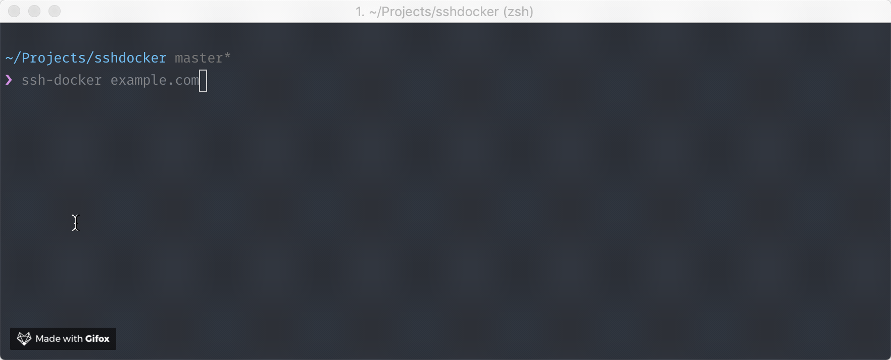

sshdocker
=========

An interactive shell for remotely connecting to docker containers over SSH.

This was primarily built to help when dealing with the names given to containers in ECS, but can be used anywhere.

Installation
------------

::

    $ pip install ssh-docker

Usage
-----

::

    $ ssh-docker <hostname>

This will open up an interactive shell (similar to how Supervisor works) allowing you to directly query / perform actions on the containers within the host.

You can then list all containers running on the host via the following:

::

    > list

Connecting to a container is as simple as using the ``connect`` command.

::

    > connect

This will list out all of the available containers on the host, which you can then choose to connect to a specific one by entering the number of the container.

If you already know the name of the container you can also specify that in the command.

::

    > connect name_of_container

By default it will attempt to run the bash shell when connecting, you can change this on a per run basis if required:

::

    > connect name_of_container /bin/ash

Connecting to a container will also print out the ssh command required to connect so you can share it with people who are not running ssh-docker.

Running arbitrary docker commands
~~~~~~~~~~~~~~~~~~~~~~~~~~~~~~~~~

You may want to run any of the available Docker commands on the server you're connected to. You can do this via the ``docker`` command:

::

    > docker [command]

Additional Tips
---------------

Autocomplete
~~~~~~~~~~~~

If you'd like to enable autocomplete in ZSH, you can add the following to your ``~/.zshrc`` file:

::

    eval "$(_SSH_DOCKER_COMPLETE=source_zsh ssh-docker)"

By entering ``ssh-docker [TAB]`` you will be able to cycle through all hostnames in your SSH config file.
